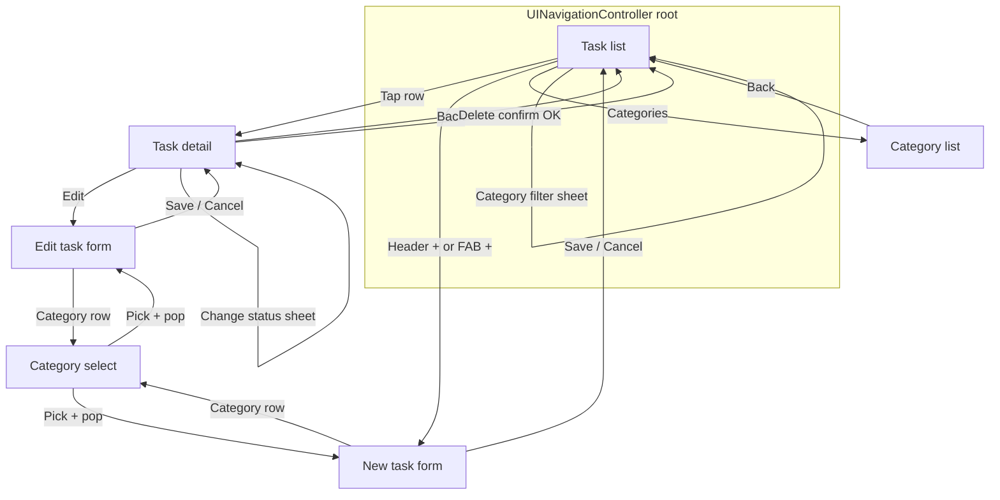

# SmartTask — QA test basis

Minimal artifacts for writing test cases: feature list + acceptance criteria per screen, navigation flow, field validation rules, and accessibility identifiers for automation. Derived from the current codebase.

**Product areas covered here:** task list, create/edit task (including **calendar due date picker**), categories, task detail (**workflow status** + subtasks), filters, and persistence.

---

## 1. Feature list and acceptance criteria (per screen)

### Task list (`TaskListViewController`)

| Feature | Acceptance criteria |
|--------|----------------------|
| Launch | App opens on task list with title **SmartTask**; standard nav bar is hidden; custom header is visible. |
| Task rows | Each task shows in the table (title, priority, **workflow status badge**, due date, category, completion control); tap row opens **Task detail**. |
| Add task | Header **+** and floating **+** both push **New Task** form; after save, user returns to list and new task appears. |
| Search | Placeholder **Search tasks**; typing filters by title and description (case-insensitive, trimmed); empty search shows all (subject to other filters). |
| Status filter | **Filter** opens action sheet: **All**, **Active**, **Completed**; choice updates visible rows; **Cancel** dismisses without change. |
| Category filter | **Filter by category** opens action sheet: **All categories** + each category name; **Cancel** dismisses; selection filters `categoryId`. |
| Categories | **Categories** pushes **Category list**; back pops to list and list refreshes. |
| Complete (cell) | Completing via cell control updates row; respects current filter (e.g. may disappear under Active). **Without subtasks:** completion toggles and **task status** stays in sync with **DONE** / **TODO** (see `toggleCompletionWithStatusSync`). **With subtasks:** toggling completion sets all subtasks done/undone and maps status to **DONE** or **TODO** when previously **DONE**. |
| Swipe — trailing | **Delete** removes task and row animates. |
| Swipe — leading | **Complete** / **Mark active** toggles completion (same status rules as cell control when subtasks exist). |
| Empty — no tasks | When there are zero tasks, empty state shows **No tasks yet** and message about **+** / floating add. |
| Empty — filtered | When tasks exist but none match search/filter, empty state shows **No matching tasks** and message about search/filter. |

### New / Edit task (`CreateTaskViewController` + `CreateTaskViewModel`)

| Feature | Acceptance criteria |
|--------|----------------------|
| Create mode | Screen id **create**; header **New Task**; **Cancel** (X) pops without saving. |
| Edit mode | Screen id **edit**; header **Edit Task**; fields pre-filled from task; save updates existing task. |
| Save | **Save** (checkmark) persists task and pops when title is valid. |
| Category | Section label **Category**; tapping the category row pushes **Category** picker; selection returns to form with row updated. |
| Due date | **Due date** switch shows/hides **calendar card** and **Clear due date**; switch off → stored due date is nil. |
| Calendar picker | **Month grid** (`CalendarDatePickerView`): previous/next **month** and **year** change visible month; tapping a **day** immediately selects that date (clamped to min/max range) and it becomes the date used on save. Root container uses id `dueDatePicker`; day cells use `smartTask_taskForm_calendarDay_<index>` (indices 0…41, row-major). |
| Priority | Segmented control: **Low**, **Medium**, **High** (default **Medium** on new task per model). |
| Task status (workflow) | **Not edited on this screen in the UI.** New tasks save with status **TODO** (`.todo`). Edit mode keeps the task’s existing status unless changed elsewhere (e.g. task detail). |

### Category select (`CategorySelectViewController`)

| Feature | Acceptance criteria |
|--------|----------------------|
| Rows | First row **None** (no category); then one row per category. |
| Selection | Tap row: choice applied via callback, screen pops. |
| Checkmark | Current selection shows checkmark. |
| Back | Back pops without changing selection (no pick). |

### Category list (`CategoryListViewController`)

| Feature | Acceptance criteria |
|--------|----------------------|
| List | Shows all categories; back pops to task list and parent refreshes. |
| Add | **+** opens **New category** alert with name field; **Create** saves non-empty trimmed name; **Cancel** dismisses. |
| Validation | Empty/whitespace name → **Cannot create** / **Name cannot be empty.** |
| Delete | Swipe **Delete** removes category. |

### Task detail (`TaskDetailViewController`)

| Feature | Acceptance criteria |
|--------|----------------------|
| Content | Title, priority badge, optional **Category: …**, description or **No description**, due or **No due date**, **workflow status badge** (TODO / DOING / DONE / LATE). |
| Change status | **Change status** opens action sheet **Status** / **Choose task status** with actions **TODO**, **DOING**, **DONE**, **LATE**; choosing one persists and refreshes UI; **Cancel** dismisses. Choosing **DONE** aligns task as completed; other statuses are not completed unless already set elsewhere. |
| Edit | **Edit** pushes same form as create, in **edit** mode; back updates detail. |
| Delete | **Delete** → confirmation **Delete task** / **This cannot be undone.** → **Delete** removes task and returns to list; **Cancel** stays on detail. |
| Mark complete | Button **Mark complete** or **Mark as active**; toggles completion and keeps **task status** in sync (e.g. complete → **DONE**, active from done → **TODO**). |
| Subtasks | List + **Add subtask**; empty title on add → **Cannot add** / **Subtask title cannot be empty.**; toggle and swipe delete work. |
| Parent sync | With subtasks, parent completion can follow “all subtasks done” logic (per `SubtaskViewModel`). |

---

## 2. Navigation / flow diagram

**Push/pop summary**

- Root: **Task list** only.
- Forward: list → detail | create | category list; create/edit → category select.
- Back from detail/create/category list/category select: `popViewController` (or dismiss alert/sheet).

---

## 3. Field validation rules (create / edit / related forms)

| Context | Field / action | Rule (as implemented) | User-visible error |
|--------|----------------|-------------------------|-------------------|
| Create / edit task | **Title** | Required after trim; whitespace-only invalid | Alert **Cannot save** — **Title cannot be empty.** (`validationAlert`) |
| Create / edit task | **Description** | Optional; all whitespace → stored as **nil** | — |
| Create / edit task | **Priority** | One of Low / Medium / High | — |
| Create / edit task | **Due date** | If switch off → `dueDate` nil; if on → saves **calendar** selected date (normalized/clamped in picker) | — |
| Create / edit task | **Category** | Optional (`nil` = none) | — |
| Create / edit task | **Task status** | Set in model: new → **TODO**; edit loads existing; UI change only from **Task detail** → **Change status** | — |
| Task (domain) | **Status vs completed** | `applyTaskStatus`: **DONE** ⇒ completed; toggling completion maps to **DONE** / **TODO** as in `Task` helpers | — |
| New category | **Name** | Required after trim | **Cannot create** — **Name cannot be empty.** |
| New subtask | **Title** | Required after trim | **Cannot add** — **Subtask title cannot be empty.** |

---

## 4. Accessibility IDs (automation reference)

**Convention:** `smartTask_<area>_<element>`; some IDs include a **UUID** (task, category, subtask) — discover at runtime from list/detail, or query by prefix.

Source of truth: `AccessibilityIDs.swift`.

### App header (per screen `context`)

| Context | Container ID | Title ID |
|---------|----------------|----------|
| `createTask` | `smartTask_appHeader_createTask_container` | `smartTask_appHeader_createTask_title` |
| `taskDetail` | `smartTask_appHeader_taskDetail_container` | `smartTask_appHeader_taskDetail_title` |
| `categoryList` | `smartTask_appHeader_categoryList_container` | `smartTask_appHeader_categoryList_title` |
| `categorySelect` | `smartTask_appHeader_categorySelect_container` | `smartTask_appHeader_categorySelect_title` |

### Task list

| Element | ID |
|---------|-----|
| Screen | `smartTask_taskList_screen` |
| Header container | `smartTask_taskList_customHeader` |
| Header title | `smartTask_taskList_headerTitle` |
| Table | `smartTask_taskList_tableView` |
| Search | `smartTask_taskList_searchBar` |
| Add (header) | `smartTask_taskList_addButton` |
| Floating add | `smartTask_taskList_floatingAddButton` |
| Filter | `smartTask_taskList_filterButton` |
| Categories | `smartTask_taskList_categoriesButton` |
| Category filter | `smartTask_taskList_categoryFilterButton` |
| Empty state | `smartTask_taskList_emptyState` |
| Empty title | `smartTask_taskList_emptyState_title` |
| Empty message | `smartTask_taskList_emptyState_message` |

### Task cell (per `taskId`)

| Element | ID pattern |
|---------|------------|
| Row container | `smartTask_taskCell_<UUID>` |
| Title | `smartTask_taskCell_title_<UUID>` |
| Priority badge | `smartTask_taskCell_priorityBadge_<UUID>` |
| **Workflow status badge** | `smartTask_taskCell_taskStatusBadge_<UUID>` |
| Due date | `smartTask_taskCell_dueDate_<UUID>` |
| Complete toggle | `smartTask_taskCell_completeToggle_<UUID>` |
| Category | `smartTask_taskCell_category_<UUID>` |

### Create / edit task form

| Element | ID |
|---------|-----|
| Screen (create) | `smartTask_taskForm_screen_create` |
| Screen (edit) | `smartTask_taskForm_screen_edit` |
| Title field (main) | `smartTask_taskForm_titleField` |
| Title field (TaskInputField pattern) | Container: `smartTask_taskForm_field_title_container` · Text: `smartTask_taskForm_field_title_text` |
| Description | `smartTask_taskForm_descriptionField` |
| Priority control | `smartTask_taskForm_priorityControl` |
| Due date region (calendar root) | `smartTask_taskForm_dueDatePicker` (container for grid; `accessibilityValue` reflects selected date) |
| **Calendar day cell** | `smartTask_taskForm_calendarDay_<index>` where **index** is `0…41` (row-major, 6×7 grid) |
| Due date switch | `smartTask_taskForm_includeDueDateSwitch` |
| Clear due date | `smartTask_taskForm_clearDueDateButton` |
| Save | `smartTask_taskForm_saveButton` |
| Cancel | `smartTask_taskForm_cancelButton` |
| Validation alert | `smartTask_taskForm_validationAlert` |
| Category row | `smartTask_taskForm_categorySelectionRow` |

### Category select

| Element | ID |
|---------|-----|
| Screen | `smartTask_categorySelect_screen` |
| Back | `smartTask_categorySelect_backButton` |
| Table | `smartTask_categorySelect_tableView` |
| Row **None** | `smartTask_categorySelect_row_none` |
| Row (category) | `smartTask_categorySelect_row_<categoryUUID>` |

### Category list

| Element | ID |
|---------|-----|
| Screen | `smartTask_categoryList_screen` |
| Back | `smartTask_categoryList_backButton` |
| Add | `smartTask_categoryList_addButton` |
| Table | `smartTask_categoryList_tableView` |
| Row | `smartTask_categoryList_row_<categoryUUID>` |
| New category alert | `smartTask_categoryList_newCategoryAlert` |
| Name field (in alert) | `smartTask_categoryList_newCategoryNameField` |
| Validation alert | `smartTask_categoryList_validationAlert` |

### Task detail

| Element | ID |
|---------|-----|
| Screen | `smartTask_taskDetail_screen` |
| Back | `smartTask_taskDetail_backButton` |
| Title | `smartTask_taskDetail_title` |
| Description | `smartTask_taskDetail_description` |
| Priority (badge) | `smartTask_taskDetail_priority` |
| Due date | `smartTask_taskDetail_dueDate` |
| **Workflow status (badge)** | `smartTask_taskDetail_taskStatusBadge` |
| **Change status** | `smartTask_taskDetail_taskStatusChangeButton` |
| **Status picker (action sheet)** | `smartTask_taskDetail_statusPickerAlert` |
| Edit | `smartTask_taskDetail_editButton` |
| Delete | `smartTask_taskDetail_deleteButton` |
| Mark complete / active | `smartTask_taskDetail_markCompleteButton` |
| Category label | `smartTask_taskDetail_categoryLabel` |
| Subtasks table | `smartTask_taskDetail_subtasksTable` |
| Add subtask | `smartTask_taskDetail_addSubtaskButton` |
| Subtask row | `smartTask_taskDetail_subtaskRow_<subtaskUUID>` |
| Subtask toggle | `smartTask_taskDetail_subtaskToggle_<subtaskUUID>` |

### Alerts (shared)

| Element | ID |
|---------|-----|
| Delete confirm alert | `smartTask_deleteConfirm_alert` |
| Delete action | `smartTask_deleteConfirm_delete` |
| Cancel action | `smartTask_deleteConfirm_cancel` |
| Filter (status) sheet | `smartTask_filter_alert` |
| Category filter sheet | `smartTask_filter_categoryAlert` |

### Automation notes

- **New subtask** alert on task detail does not set `accessibilityIdentifier` on the alert view; UI tests may use button titles (**Add**, **Cancel**) or add IDs in `AccessibilityIDs.swift` later.
- **Calendar** header uses localized accessibility labels (**Previous year**, **Previous month**, **Next month**, **Next year**) on the nav buttons.

### Task status display names (UI strings)

| `TaskStatus` | Action sheet / badge text |
|--------------|---------------------------|
| `todo` | **TODO** |
| `doing` | **DOING** |
| `done` | **DONE** |
| `late` | **LATE** |
